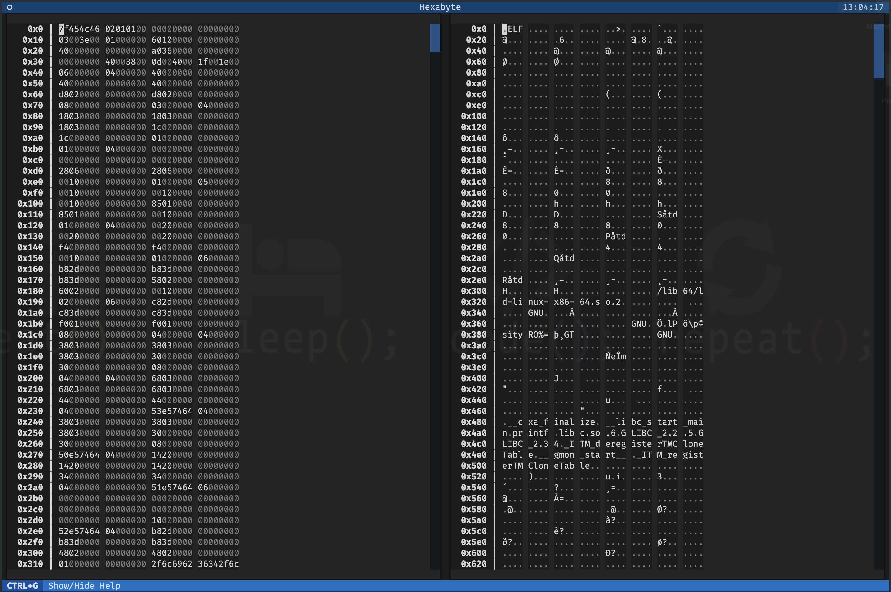
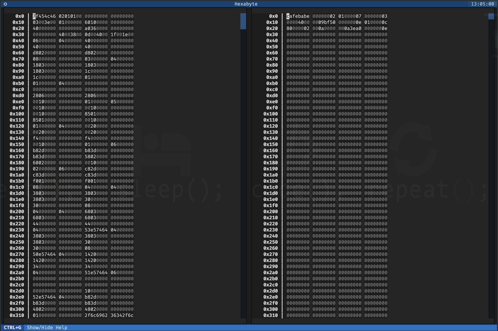
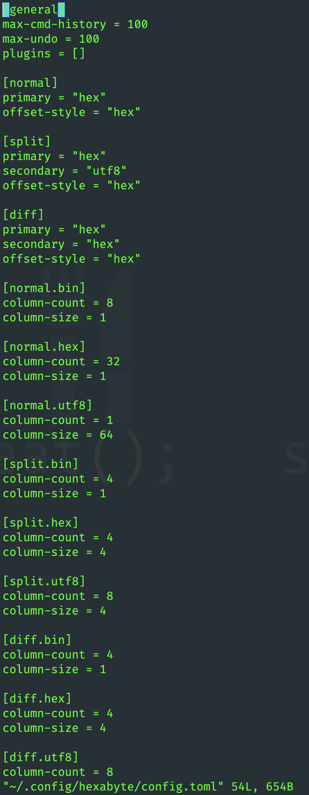

# Hexabyte - Commandline Hex Editor

[](https://pypi.python.org/pypi/hexabyte)
[](https://pypi.python.org/pypi/hexabyte)
[](https://pypi.org/project/hexabyte/)
[](https://pypi.python.org/pypi/hexabyte)
[](https://pypi.python.org/pypi/hexabyte)
[](https://pypi.org/project/hexabyte/)
[](https://pypi.org/project/hexabyte/)

[](https://github.com/thetacom/hexabyte/actions/)
[](https://github.com/thetacom/hexabyte/actions/)
[](https://github.com/thetacom/hexabyte/actions/)
[](https://github.com/thetacom/hexabyte/actions/)

[](https://github.com/pre-commit/pre-commit)
[](https://github.com/charliermarsh/ruff)


A modern, robust, and extensible commandline hex editor.

> **NOTE:** To reduce the number of dependencies of the core editor. The builtin plugins have been moved into separate packages. They are [hexabyte_extended_info](https://github.com/thetacom/hexabyte_extended_info) and [hexabyte_entropy](https://github.com/thetacom/hexabyte_entropy).

## User

### Install

```bash
~/$ pip install hexabyte
...
```

### Run

```bash
~/$ hexabyte --help
usage: hexabyte [-h] [-c CONFIG_FILEPATH] [-s] [files ...]

Hexabyte can operate in three distinct modes. Single file mode opens a single file with a single editor. Split screen mode opens a single file with a split screen view. Diff
mode opens two files side by side.

positional arguments:
  files                 Specify 1 or 2 filenames

options:
  -h, --help            show this help message and exit
  -c CONFIG_FILEPATH, --config CONFIG_FILEPATH
                        Specify config location. Default: ~/.config/hexabyte/config.toml
  -s, --split           Display a single file in two split screen editors.
```

Help Screen


Command Prompt


Single File - Split Screen



Single File - Hexadecimal View Mode


UTF8 View Mode


Binary View Mode


Two Files - Diff View


### Plugins and Customization

Hexabyte's interface is highly customizable. You can adjust the column size and column count for each view mode.



Hexabyte functionality can be extended through the use of plugins.

## Developer

```bash
~/$ git clone https://github.com/thetacom/hexabyte
...
~/$ cd hexabyte
hexabyte/$ poetry install
...
```

### Test

```bash
hexabyte/$ make test
...
```
